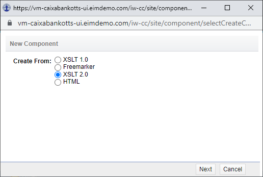
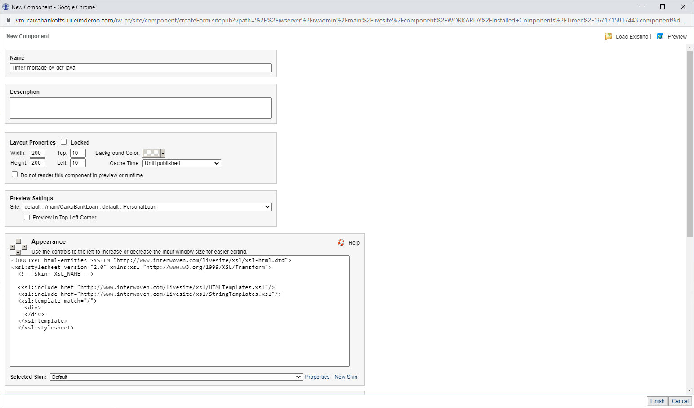
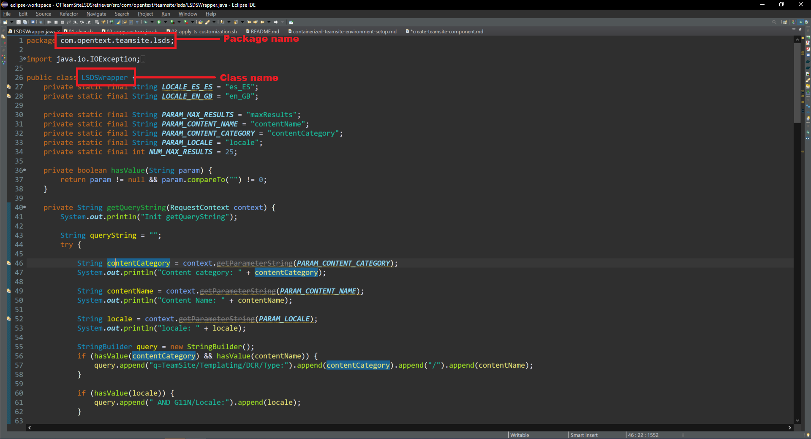

# Create a TeamSite component

Follow these steps to create a **XSLT 2.0 TeamSite component** that use this customization 
that use the `TeamSite LiveSite Display Services (LSDS) API` to access to `Content Items`

## Create a component

 - Open TeamSite in your browser
 - Go to `CC PRofessional`
 - Select `File > New Component`
 - Select `xslt` on the **New Component** pop-up
 - Select `XSLT 2.0`
 
   
   
 - Click on `Next` button
 - Set properties in the **New Component** pop-up
 
    

   - **Name**: Timer-mortage-by-dcr-java
   - **Appearance**: Keep it as is right now. We'll discuss it later
   - **Content XML**: Copy this XML the `Content XML` field
		
```xml
<Data>
  <Datum ID="TITLE" Type="String" Name="Title">Nuestros Créditos</Datum>
  <External>
    <Parameters>
      <!-- <Datum ID="DOCUMENT-QUERY" Name="documentQuery" Type="String">q=TeamSite/Templating/DCR/Type:Economy/Market</Datum> -->
      <Datum ID="CONTENT-CATEGORY" Name="contentCategory" Type="String">blog</Datum>
      <Datum ID="CONTENT-NAME" Name="contentName" Type="String">Loan</Datum>
      <Datum ID="LOCALE" Type="SelectSingle" Name="locale">
        <Option>
          <Display>Spanish (Spain)</Display>
          <Value>es_ES</Value>
        </Option>
        <Option>
          <Display>English (Great Britain)</Display>
          <Value>en_GB</Value>
        </Option>
      </Datum>
      <Datum ID="MAX-RESULTS" Type="SelectSingle" Name="maxResults">
        <Option>
          <Display>1</Display>
          <Value>1</Value>
        </Option>
        <Option>
          <Display>2</Display>
          <Value>2</Value>
        </Option>
        <Option>
          <Display>3</Display>
          <Value>3</Value>
        </Option>
        <Option Selected="true">
          <Display>4</Display>
          <Value>4</Value>
        </Option>
        <Option>
          <Display>5</Display>
          <Value>5</Value>
        </Option>
        <Option>
          <Display>8</Display>
          <Value>8</Value>
        </Option>
        <Option>
          <Display>12</Display>
          <Value>12</Value>
        </Option>
        <Option>
          <Display>16</Display>
          <Value>16</Value>
        </Option>
        <Option>
          <Display>20</Display>
          <Value>20</Value>
        </Option>
        <Option>
          <Display>24</Display>
          <Value>24</Value>
        </Option>
        <Option>
          <Display>28</Display>
          <Value>28</Value>
        </Option>
        <Option>
          <Display>32</Display>
          <Value>32</Value>
        </Option>
      </Datum>
    </Parameters>
    <Object Scope="local">com.opentext.teamsite.lsds.LSDSWrapper</Object>
    <Method>getDCRAssets</Method>
  </External>
</Data>
```

> **NOTE**: 
> `Object` tag includes the class name that we have created, including the package.
> The `Method` tag includes the method name defined in our Java class.


   

   - Click on `Finish` button
   
## Publish the component