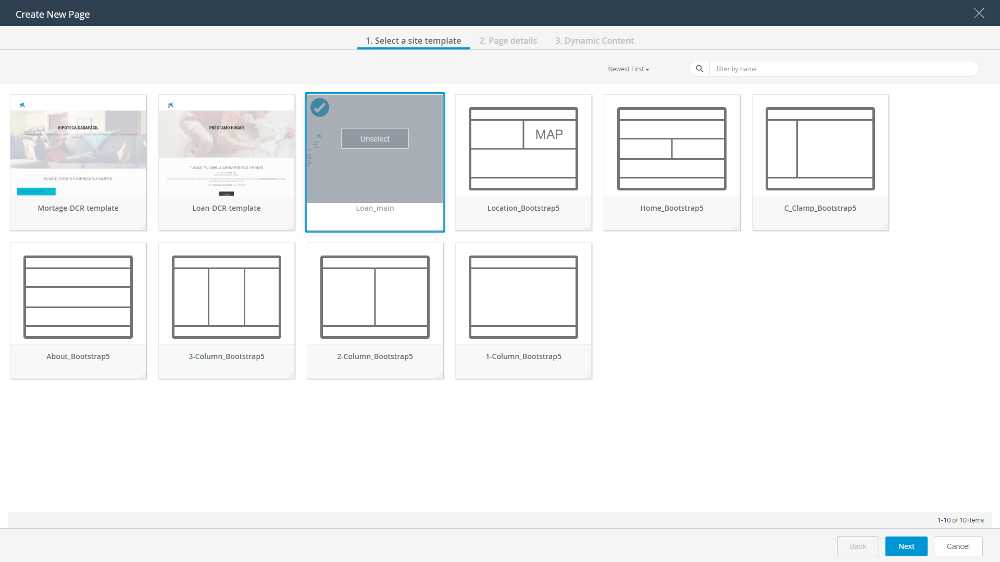
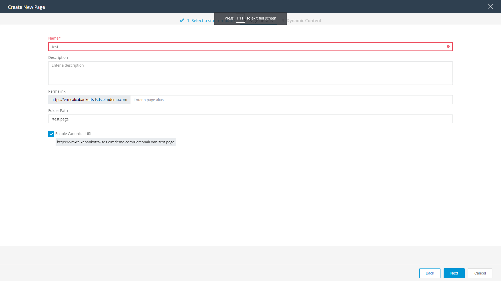
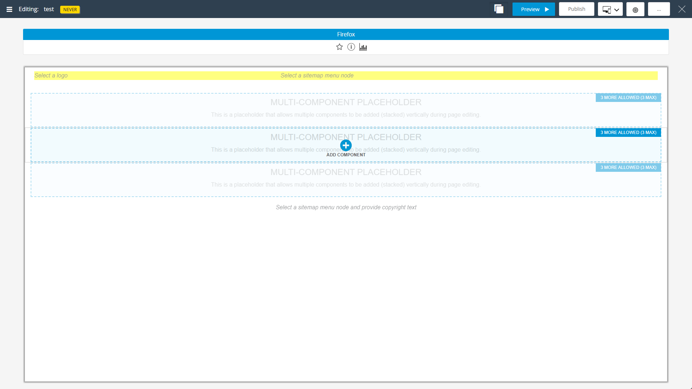
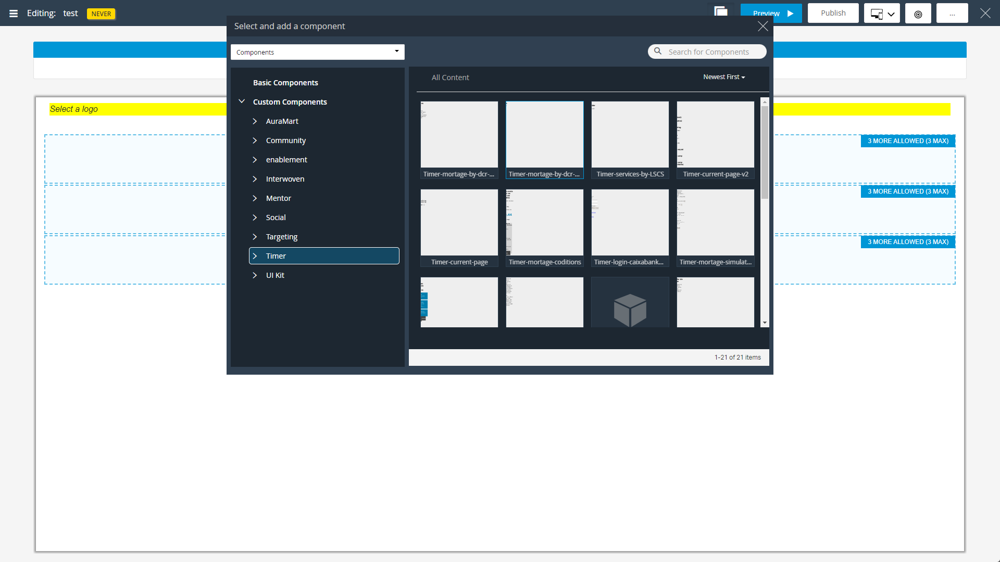
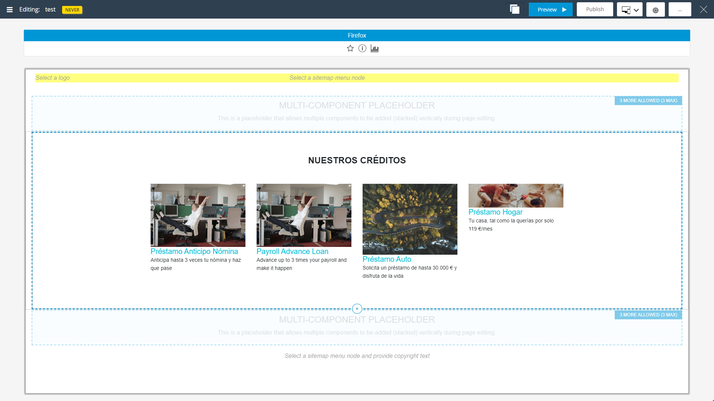
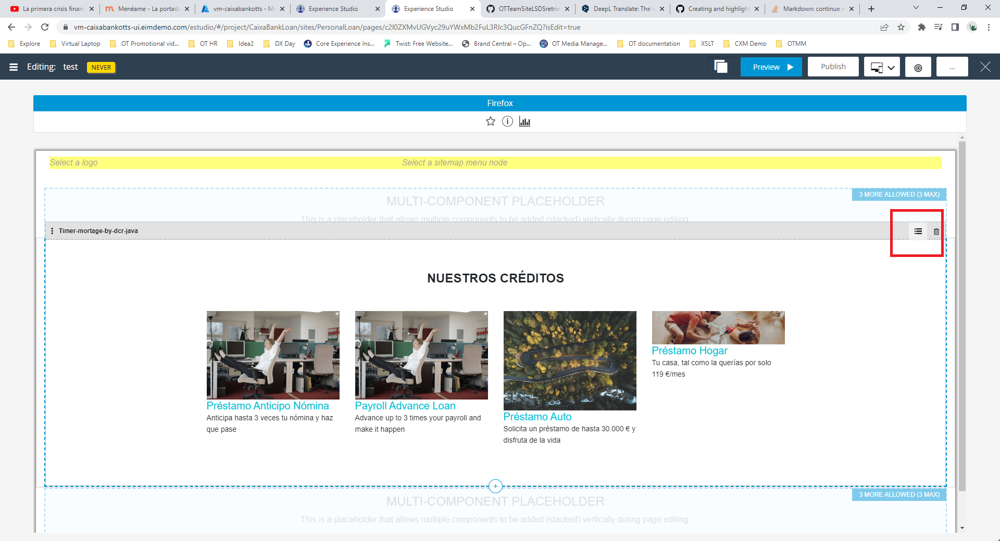
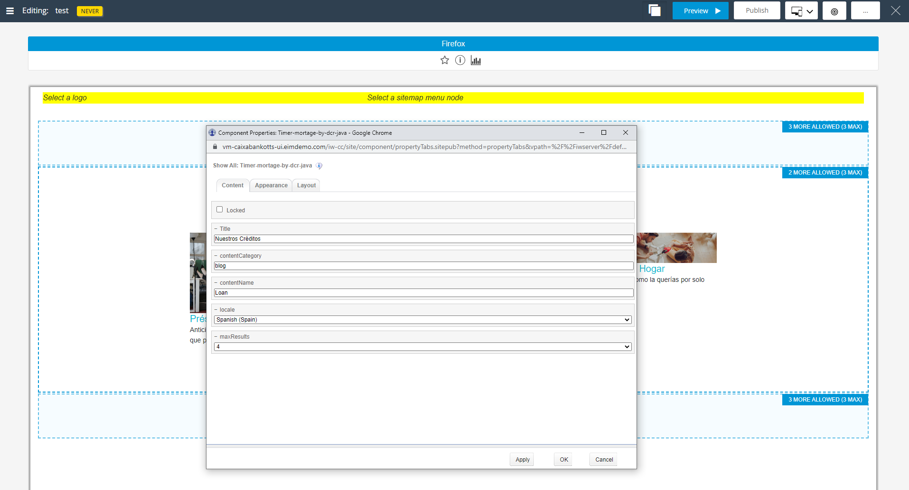

# Use the component in a TeamSite page

To use our component in a new page we must follow these steps:

 - Go to `Experience Studio`
 - Click on `Sites`
 - Click on your site, i.e, *PersonalLoan*
 - Click on `New page` button
 - Select a template 
 
 
 
 - Click on `Next` button
 - Set a page **name**, i.e. test
 
  
  
 - Click on `Next` button
 - Click on `Confirm` button
 - On the *Editing* page, click on `ADD COMPONENT` 
 
   
   
 - On the *Editing* page, click on `ADD COMPONENT`    
 
    
    
 - Select your component
 
    
    
The job is done. Now, you can customize the behavior of your component, just click on the *hamburger icon* on the left-hand side of the component

    

You can modify the properties if you want:

    

 
 
 